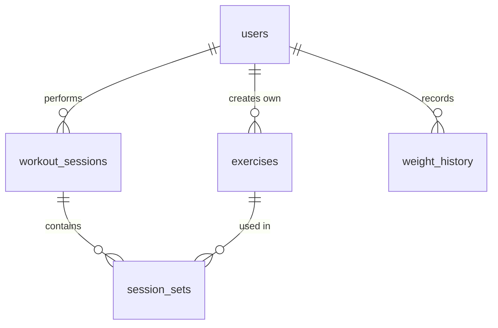

# FitTrack — Database Design (V1)

Source of truth for the real database will be Laravel migrations. This document is for planning the data first.

**General rules**

- Weight is always stored in **kilograms** (`weight_kg`).
- Dates and times are stored in **UTC**.
- Every user's data is linked through `user_id`.
- `created_at` / `updated_at` exist on every table (Laravel adds them via `$table->timestamps()`), so they are not repeated below.

---

# users

Accounts for both athletes and coaches.

| Field            | Type        | Required | Description                             |
|------------------|-------------|----------|-----------------------------------------|
| id               | bigint (PK) | yes      |                                         |
| name             | string      | yes      | Display name                            |
| email            | string      | yes      | Unique; used for logging in             |
| password         | string      | yes      | Hash only (Hash::make)                  |
| role             | string      | yes      | athlete or coach; defaults to athlete   |
| plan             | string      | yes      | Defaults to "free" (monetization later) |
| height_cm        | smallint    | no       | Height in centimeters                   |
| goal             | string      | no       | lose_fat / gain_muscle / maintain       |
| experience_level | string      | no       | beginner / intermediate / advanced      |

**Relations:** one user has many exercises, workout sessions and weight records.

**Notes:**
- Current body weight is NOT stored here. It lives in `weight_history`, so old values are not overwritten.
- Auth tokens (Sanctum) use their own `personal_access_tokens` table, created automatically.

---

## exercises

Exercise catalog: shared exercises (for everyone) and personal ones (created by a user).

| Field | Type | Required | Description |
|---|---|---|---|
| id | bigint (PK) | yes | |
| user_id | bigint (FK) | no | NULL = shared exercise, otherwise the author |
| name | string | yes | e.g. "Bench Press" |
| muscle_group | string | yes | chest / back / legs / shoulders / arms / core |
| description | text | no | Technique, notes |
| image_url | string | no | Image or instruction link |

**Relations:** `users 1:N exercises` (optional), `exercises 1:N session_sets`.

**Notes:**
- A user sees: `WHERE user_id IS NULL OR user_id = :my_id`.
- Muscle group is a plain string for now; a separate table is unnecessary complexity at this stage.

---

## workout_sessions

One performed (or in-progress) workout.

| Field | Type | Required | Description |
|---|---|---|---|
| id | bigint (PK) | yes | |
| user_id | bigint (FK) | yes | Who trained |
| title | string | yes | e.g. "Chest Day" |
| started_at | timestamp | yes | When the workout started |
| finished_at | timestamp | no | NULL = still in progress or abandoned |
| note | text | no | Comment on the workout |
| assigned_workout_id | bigint (FK) | no | Reserved for V2: link to a coach-assigned workout |

**Relations:** `users 1:N workout_sessions`, `workout_sessions 1:N session_sets`.

**Notes:**
- No `status` field: a workout is unfinished when `finished_at` is empty.
- `assigned_workout_id` stays NULL in V1 (it can be added in a later migration). It shows that plan and actual result are separate things linked by a reference.

---

## session_sets

One set inside a workout. This is the actual result.

| Field | Type | Required | Description |
|---|---|---|---|
| id | bigint (PK) | yes | |
| workout_session_id | bigint (FK) | yes | Which workout it belongs to |
| exercise_id | bigint (FK) | yes | Which exercise |
| exercise_order | smallint | yes | Position of the exercise in the workout (1, 2, 3...) |
| set_number | smallint | yes | Set number within the exercise (1, 2, 3...) |
| reps | smallint | yes | Number of repetitions |
| weight_kg | decimal(6,2) | yes | Weight in kg (0 for bodyweight) |
| is_warmup | boolean | yes | Warm-up set; defaults to false |
| rpe | decimal(3,1) | no | Effort on a 1-10 scale |
| note | string | no | Comment on the set |

**Relations:** `workout_sessions 1:N session_sets`, `exercises 1:N session_sets`.

**Notes:**
- No separate `workout_exercises` table: the exercise list of a workout comes from grouping sets by `exercise_id`, ordered by `exercise_order`.
- `is_warmup` keeps warm-ups out of statistics and personal records.
- `decimal`, not `float`, for weight (2.5 or 22.5 kg, no rounding errors).

---

## weight_history

Body weight by date.

| Field | Type | Required | Description |
|---|---|---|---|
| id | bigint (PK) | yes | |
| user_id | bigint (FK) | yes | Whose weight |
| weight_kg | decimal(5,2) | yes | Body weight in kg |
| measured_on | date | yes | Date of the measurement |
| note | string | no | e.g. "after vacation" |

**Constraint:** (`user_id`, `measured_on`) is unique, so there is **one record per day**.

**Relations:** `users 1:N weight_history`.

---

## Relations diagram

---

## Later (V2, Coach System) — not implemented yet

- `coach_athletes`: coach ↔ athlete link (invitation status: pending / accepted)
- `plans`: optional container (week or month) over assigned workouts
- `assigned_workouts`: workout assigned by a coach for a date
- `planned_sets`: planned reps and weight
- `workout_comments`: comments from coach and athlete
